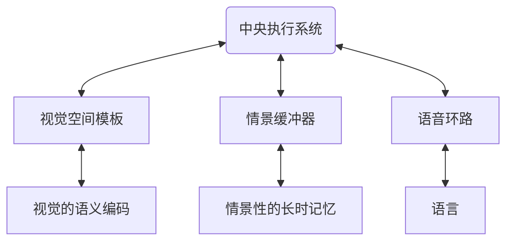

## 概述

短时记忆是感觉记忆和长时记忆中间阶段，暂时的存储信息。保持时间大约在 5秒~1 分钟之内。容量有限，为7±2个组块。短时记忆的信息经过复述进入[长时记忆](长时记忆.md)。

巴德利等人主张用工作记忆的概念扩展短时记忆的概念。**工作记忆**是指在信息加工过程中对信息进行暂时存储和加工的，容量有限的记忆系统。是一种为当前动作而服务的记忆，即人在工作状态下所需记忆内容的短暂提取与保留。

工作记忆是由多个成分组成的加工系统，包括语音环路，视觉空间模板，情景缓冲器和中央执行系统是个成分。

## 组成

- 视觉空间模板处理视觉和空间信息。
- 情景缓冲器是用来整合视觉，空间和言语信息，与长时记忆相连。
- 语音环路处理以语音为基础的信息。有语音存储和发音复述过程两部分组成。
- 中央执行系统是注意资源有限的控制系统。负责协调活动，分配和控制资源。

## 影响因素

- 觉醒状态：大脑皮层的兴奋水平影响短时记忆编码的效果。兴奋剂可以促进学习，而酒精会抑制学习。上午的学习效果比下午好。
- 加工深度：对学习内容加工深度越高，理解约深刻，越能提高记忆水平。
- 组块：对记忆的内容组块化或者扩大每一个组块中包含的信息量，可以提高记忆的编码效果。

## 容量

短时记忆的容量是以单元来计算。一个单元可以是一个数字，字母，音节或单词，短语，句子。将较小的单元归并成一个较大的单元，叫**组块化**。这种方式形成的信息单位叫做**块**。利用已有的知识经验扩大每个组块的信息量，可以增加记忆效果。

> [!example] 
> 将数字1，9，1，9，5，4可以形成主块191954并知道，这是五四运动的年代。这样编码可以帮助记忆。

## [短时记忆的进程](短时记忆的进程.md)

## 关系

- [刻意练习](刻意练习.md)
