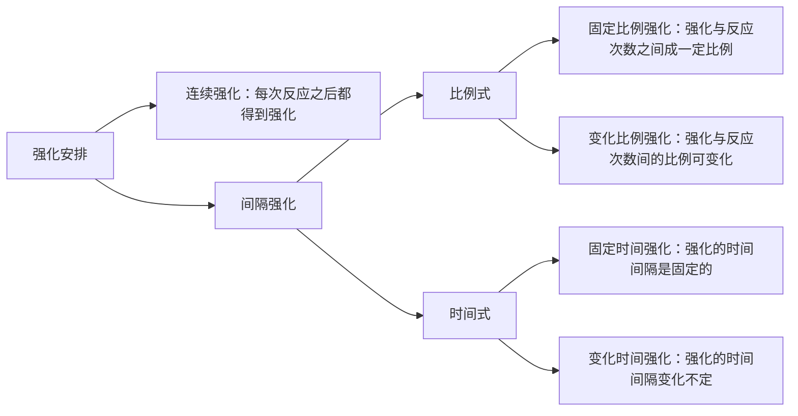

## 概述

操作性条件作用，由美国行为主义心理学家**伯尔赫斯·斯金纳**提出并系统阐述，核心思想是：行为的结果（后果）决定了该行为在未来是否会重复发生。个体 " 操作 " 环境，从而产生某种结果，这个结果反过来又影响了行为。

## 斯金纳箱实验

一只老鼠被关在一个装有杠杆和食物盘的箱子里。

| 核心概念 | 描述 | 在实验中的体现 |
| :--- | :--- | :--- |
| **操作行为** | 个体**主动发出**的、作用于环境并产生结果的行为。 | **老鼠按压杠杆** |
| **结果（后果）** | 行为发生之后环境发生的变化。 | **食物丸出现** |
| **强化** | 任何**使行为频率增加**的结果。 | 食物丸的出现，使得老鼠压杠杆的行为增加。 |

## 强化的类型

### 正强化

- **描述**：通过**呈现**一个**愉快的刺激**，使行为频率增加。
- **例子**：
    - 努力工作后获得奖金（奖金是愉快刺激）。
    - 孩子做完作业后可以看电视（看电视是愉快刺激）。

### 负强化

- **描述**：通过**移除或避免**一个**厌恶的刺激**，使行为频率增加。
- **例子**：
    - 系好安全带以消除汽车刺耳的提示音（移除厌恶刺激）。
    - 努力学习以避免考试不及格（避免厌恶刺激）。

## 强化程序

强化的时机和规律对行为的建立和维持有巨大影响。

## 应用

1. **行为矫正**：通过系统地应用强化和惩罚，来塑造和改变个体（包括特殊儿童）的不良行为，建立良好行为。
2. **程序教学**：斯金纳将这一原理应用于教育，主张将学习材料分解成小步骤，对学生的每一步正确反应立即给予强化，允许学生自定步调。
3. **组织行为管理**：在企业管理中，通过奖金、表扬、晋升（正强化）等机制来提高员工的工作效率和积极性。
4. **父母教育与儿童养育**：为父母提供了如何通过关注和表扬（正强化）来鼓励好行为，以及通过取消特权（负惩罚）来减少不良行为的科学方法。
