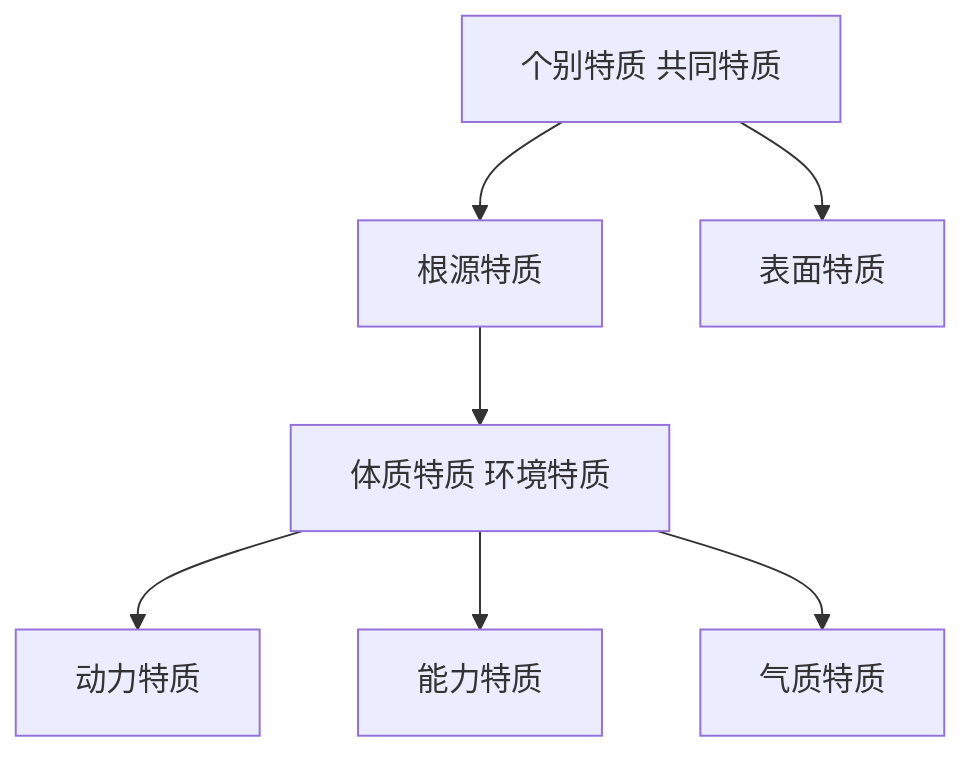

## 概述

卡特尔受元素周期表启发，用因素分析方法对人格特质进行分析。提出人格特质的结构网络模型和 [卡特尔16种人格因素调查表](卡特尔16种人格因素调查表.md)。

## 模型

- 表面特质：从外部行为能直接观察到的特质。
- 根源特质：相互联系，并以相同原因为基础的行为特质。
    - 体质特质：由先天的生物因素决定
    - 环境特质：由后天的环境因素决定
        - 动力特质：具有动力特征的特质，使人趋向某一风格，包括生理驱力，态度和情操
        - 能力特质：决定人如何有效完成预定目标的特质包括流体智力和晶体智力
        - 气质特质：决定一个人情绪反应的速度和强度的特质
