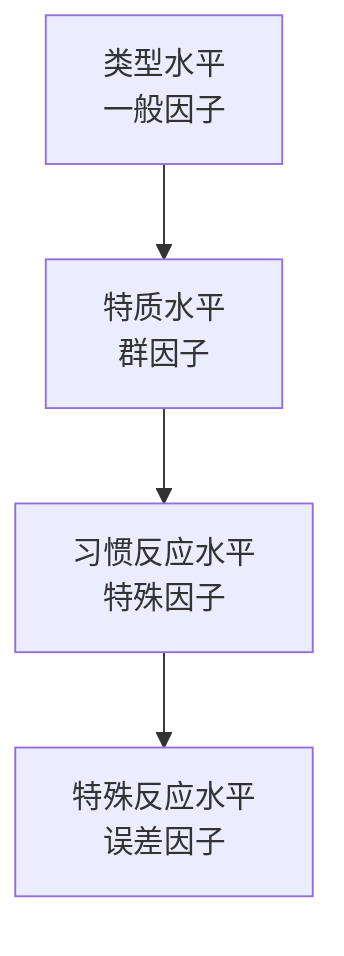

## 概述

由英国心理学家汉斯·艾森克提出。将人格结构从具体的反应到一般的类型进行了系统性的分层

## 结构

该模型认为人格是一个多层次、有等级的结构，从下至上、从特殊到一般，共包含四个层次。

### 特定反应水平

- **定义**：个体在特定情境下的一次性行为反应。这是最具体、最不稳定的层次。
- **例子**：某天晚上，你同意和朋友一起去参加一个聚会。
- **性质**：可能是偶然的，不能据此推断稳定的人格特质。

### 习惯反应水平

- **定义**：如果个体在类似情境中反复出现相同的特定反应，它们就会固化为一种 " 习惯反应 "。
- **例子**：每次朋友邀请你参加社交聚会，你通常都会同意前往。
- **性质**：比特定反应稳定，代表了一种行为倾向，但范围仍然有限。

### 特质水平

- **定义**：通过因素分析，将许多相关的习惯反应聚类在一起，就形成了更概括、更稳定的 " 特质 "。特质是观察到的个体行为倾向的相互关联。
- **例子**：将 " 喜欢参加聚会 "、" 乐于结识新朋友 "、" 在人群中感到自在 " 等习惯反应汇总，可以归纳出 " 社交性 " 这一特质。
- **性质**：是人格的基本维度，具有跨情境和跨时间的稳定性。

### 类型水平（超级特质）

- **定义**：通过更高阶的因素分析，将一组高度相关的特质组合起来，就形成了最一般、最概括的 " 类型 " 或 " 超级特质 "。这是人格的最高层次。
- **例子**：" 社交性 "、" 活跃性 "、" 支配性 "、" 冲动性 " 等特质可以共同负载于一个高阶因素上，即 " 外倾性 " 类型。
- **性质**：类型是人格最广泛的维度，具有极强的生物学基础。
